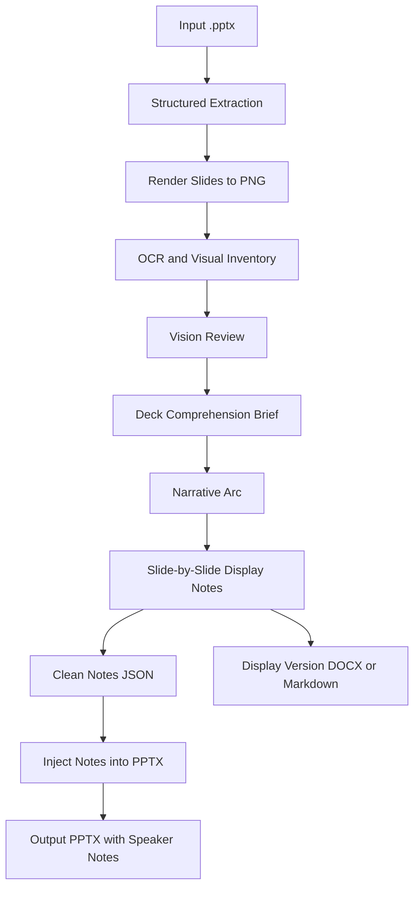
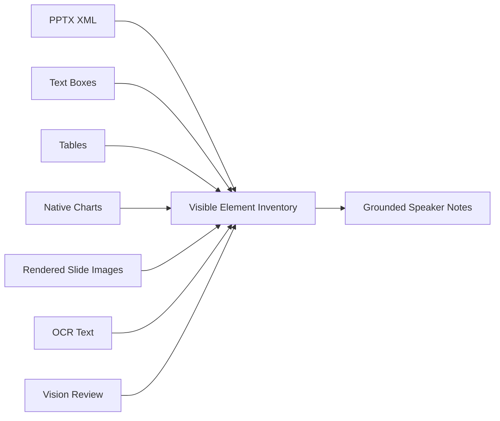
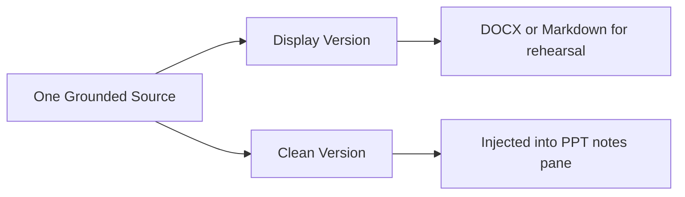

# speaker


[中文说明](README.zh.md)

`speaker` is a Codex skill project for academic presentations. It reads a real `.pptx`, combines text extraction, PPTX structure inspection, slide rendering, OCR, and vision review, then generates grounded speaker notes and injects the clean script into PowerPoint's speaker notes pane.

> Current skill package: `speaker-v7.skill`  
> Internal skill name: `ppt-speech-writer`

## What It Solves

Many presentation-note tools only read text boxes. That misses charts, screenshots, SmartArt, axes, legends, tables, and text embedded in images. This skill is designed to keep speaker notes grounded in the actual slides:

- Build a visible-element inventory for every slide.
- Review visually complex content with a vision-capable agent or human reviewer.
- Tie each spoken sentence to visible slide evidence.
- Produce two versions: a display version for rehearsal and a clean version for PowerPoint notes.

## Workflow



## Evidence Chain



## Features

| Feature | Description |
|---|---|
| Text extraction | Extracts titles, body text, placeholders, and text boxes |
| Table extraction | Reads row and column text from PowerPoint tables |
| Chart extraction | Attempts to read native chart titles, categories, series, values, axes, and legends |
| OOXML fallback | Extracts additional slide XML text not exposed by `python-pptx`, including some SmartArt or grouped-shape text |
| Slide rendering | Renders slides to PNG so the final visual presentation can be inspected |
| OCR | Optionally reads text in screenshots, images, small labels, and other visual regions |
| Vision review | Produces a review packet for a vision-capable agent or human reviewer |
| Notes injection | Writes clean speaker notes into the PowerPoint notes pane |
| Display document | Generates a complete rehearsal document as `.docx`, with Markdown fallback when `python-docx` is unavailable |

## Repository Layout

```text
ppt-speech-writer/
├── SKILL.md
└── scripts/
    ├── read_slides.py
    ├── render_slides.py
    ├── visual_inventory.py
    ├── vision_review.py
    ├── write_display_docx.py
    └── inject_notes.py

speaker-v7.skill
```

Claude Code compatibility:

```text
.claude/skills/ppt-speech-writer -> ../../ppt-speech-writer
CLAUDE.md
```

## Installation

Download or use the packaged skill:

```text
speaker-v7.skill
```

Install it using your Codex client's skill import flow. Once installed, use it when you need speaker notes, presenter notes, a speech script, or narration for a real `.pptx` file.

For Claude Code, this repository includes a project skill at `.claude/skills/ppt-speech-writer`. Open Claude Code from the repository root and invoke:

```text
/ppt-speech-writer
```

If Claude Code is already running, use `/reload-skills` after pulling updates.

## Example Prompt

```text
Use speaker / ppt-speech-writer to write a 15-minute academic presentation script
for this PowerPoint deck. Inject the clean script into speaker notes and also
generate a complete display-version rehearsal document.
```

The skill will:

1. Read the full deck.
2. Render every slide.
3. Build a visual inventory.
4. Run vision review for visually complex content.
5. Produce a Deck Comprehension Brief.
6. Confirm the narrative arc.
7. Write display notes and clean notes.
8. Generate the complete display document.
9. Inject clean notes into the `.pptx`.
10. Keep intermediate evidence files inside `work/`.

Before writing notes, the skill must explicitly confirm the output language. It does not infer the note language from the language you use in chat.

## Outputs

Most users only need the top-level deliverables:

| Top-level output | Purpose |
|---|---|
| `<deck-stem>-with-notes.pptx` | PowerPoint file with speaker notes injected |
| `<deck-stem>-display.docx` | Complete rehearsal script with slide labels, transitions, glossary, and timing table |
| `<deck-stem>-display.md` | Markdown fallback when `python-docx` is unavailable |
| `<deck-stem>-vision-review.md` | Markdown packet for human or vision-agent review |

Intermediate files are grouped under `work/`:

```text
<deck-stem>-speaker-output/
├── <deck-stem>-with-notes.pptx
├── <deck-stem>-display.docx
├── <deck-stem>-display.md
├── <deck-stem>-vision-review.md
└── work/
    ├── slide_extract.json
    ├── visual_inventory.json
    ├── vision_review_packet.json
    ├── vision_review.json
    ├── display_document.json
    ├── notes.json
    └── rendered_slides/
```

## Script Reference

### 1. Structured extraction

```bash
python scripts/read_slides.py "/path/to/deck.pptx" \
  --output "<deck-stem>-speaker-output/work/slide_extract.json"
```

Reads text boxes, tables, charts, picture objects, OOXML text, and existing notes.

### 2. Slide rendering

```bash
python scripts/render_slides.py "/path/to/deck.pptx" \
  --output-dir "<deck-stem>-speaker-output/work/rendered_slides"
```

Renders slides to PNG. The script tries LibreOffice / `soffice` first and falls back to macOS Quick Look when available.

### 3. Visual inventory

```bash
python scripts/visual_inventory.py \
  --extract "<deck-stem>-speaker-output/work/slide_extract.json" \
  --rendered-dir "<deck-stem>-speaker-output/work/rendered_slides" \
  --output "<deck-stem>-speaker-output/work/visual_inventory.json" \
  --ocr auto
```

Combines structured extraction, rendered slide paths, and OCR text into a per-slide coverage inventory.

### 4. Vision review packet

```bash
python scripts/vision_review.py \
  --inventory "<deck-stem>-speaker-output/work/visual_inventory.json" \
  --output "<deck-stem>-speaker-output/work/vision_review_packet.json" \
  --markdown "<deck-stem>-speaker-output/<deck-stem>-vision-review.md"
```

Prepares review prompts and evidence for a vision-capable agent or human reviewer.

### 5. Display document

```bash
python scripts/write_display_docx.py \
  --input "<deck-stem>-speaker-output/work/display_document.json" \
  --output "<deck-stem>-speaker-output/<deck-stem>-display.docx"
```

Writes the display-version rehearsal document. If `python-docx` is missing, it writes a Markdown fallback.

### 6. Speaker notes injection

```bash
python scripts/inject_notes.py \
  --input "/path/to/deck.pptx" \
  --output "<deck-stem>-speaker-output/<deck-stem>-with-notes.pptx" \
  --notes "<deck-stem>-speaker-output/work/notes.json" \
  --mode replace
```

Injects clean notes into the PowerPoint notes pane.

## Display Version vs Clean Version



| Version | Content | Use |
|---|---|---|
| Display version | Slide labels, separators, transitions, pauses, emphasis marks, glossary, timing table | Rehearsal and review |
| Clean version | Spoken text only | Injected into PowerPoint speaker notes |

## Language And Style Rules

- The output language must be confirmed before drafting.
- The full deliverable must use one language consistently.
- Canonical technical terms may remain in English, but sentence grammar must follow the selected language.
- Slide notes must not start with template phrases such as "This slide shows..." or "On this slide...".
- Chinese notes must not start with phrases such as "这一页展示了..." or "在这一页中..."。
- Each slide should open with the actual claim, finding, method role, or argument step.

## Dependencies

Useful dependencies:

- `python-pptx` for PPTX structure extraction and speaker-note injection
- LibreOffice / `soffice` for high-quality slide rendering
- macOS `qlmanage` as a rendering fallback
- `tesseract` for OCR
- `python-docx` for Word display documents

If a dependency is missing, the skill uses the strongest available evidence and reports the limitation. For complex charts, screenshots, SmartArt, and image-only slides, final notes should not be produced without vision review.

## Limits

This skill aims to cover and explain visible slide elements as completely as possible. It does not claim that scripts can automatically understand every visual element with perfect semantic accuracy.

Why:

- Images and screenshots are pixels, not structured semantic objects.
- OCR can fail on small text, formulas, low contrast, or rotated labels.
- SmartArt, arrows, and layout relationships often depend on author intent.
- A chart may be a screenshot rather than a native PowerPoint chart.

The skill improves reliability through script-based discovery, rendering, OCR, vision review, and explicit coverage notes. Uncertain elements must be marked, not invented.

## Updating The Package

After modifying the source folder, rebuild the `.skill` package:

```bash
zip -r speaker-v8.skill ppt-speech-writer -x '*/__pycache__/*'
```

The `.skill` file is a fixed package. Editing `ppt-speech-writer/` does not automatically update an already packaged or installed skill.

## Best For

- Academic conference talks
- Thesis defenses
- Lab meetings
- Research project briefings
- Slide-grounded speaker scripts
- Decks with charts, screenshots, SmartArt, or method diagrams

## Not Ideal For

- Free-form speeches that ignore slide content
- Marketing copy that exaggerates beyond slide evidence
- Requests without a real `.pptx` file
- Workflows that cannot perform vision review for complex visual slides
