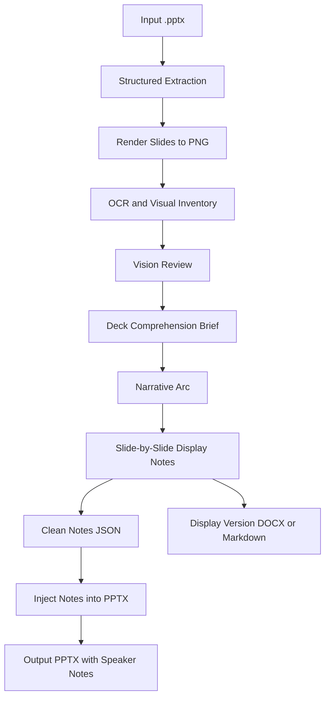
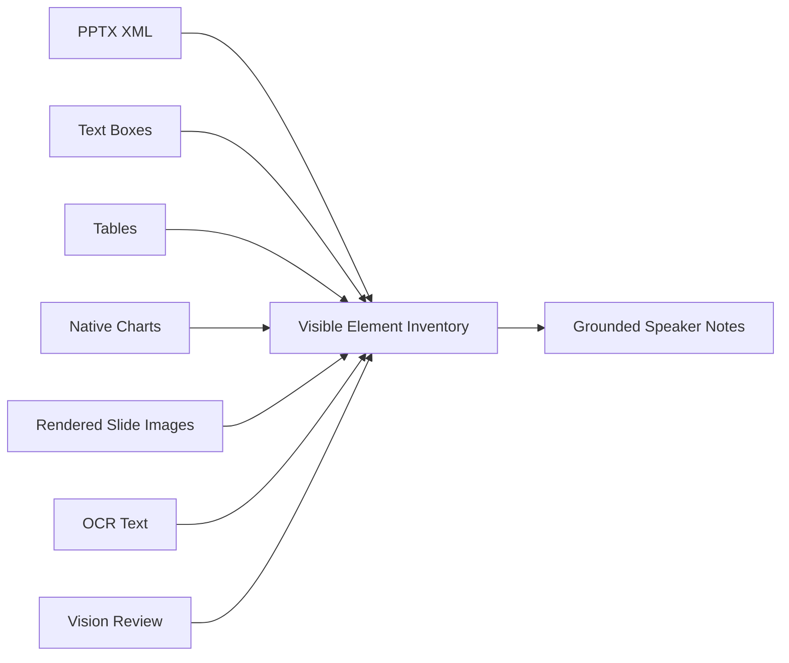
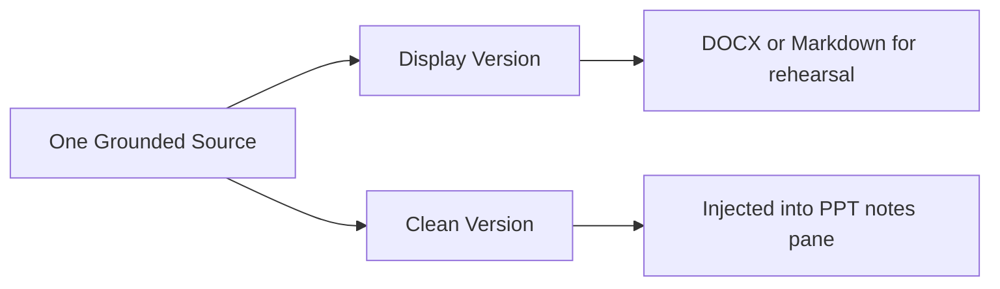

# speaker


[English README](README.md)

`speaker` 是一个面向学术汇报的 Codex skill 项目：读取真实 `.pptx`，结合文本抽取、PPTX 结构解析、逐页渲染、OCR 和视觉审查，生成逐页 speaker notes，并把干净版讲稿写入 PowerPoint 备注区。

> 当前安装包：`speaker-v7.skill`  
> 内部 skill 名称：`ppt-speech-writer`

## 它解决什么问题

很多 PPT 讲稿生成工具只读文本框，容易漏掉图表、截图、SmartArt、坐标轴、图例、表格和图片里的文字。本 skill 的目标不是“凭空写一篇顺滑讲稿”，而是让讲稿严格 grounded in slides：

- 每页先建立 visible-element inventory
- 对复杂视觉内容进行 vision review
- 每句话都回到当前 slide 的可见证据
- 输出两种版本：排练用 display version 和写入 PPT notes 的 clean version

## 工作流一览



## 证据链设计



## 核心能力

| 能力 | 说明 |
|---|---|
| 文本框读取 | 提取标题、正文、placeholder 和普通文本框 |
| 表格读取 | 读取 PowerPoint 表格的行列文本 |
| 图表读取 | 尝试读取原生 chart 的标题、分类、series、数值、坐标轴和图例 |
| OOXML 补充 | 从 slide XML 中提取 `python-pptx` 未暴露的文字，如部分 SmartArt 或组合对象文本 |
| 幻灯片渲染 | 将每页 PPT 渲染为 PNG，检查最终视觉呈现 |
| OCR | 对截图、图片文字、小标签进行可选 OCR |
| Vision review | 为复杂页面生成视觉审查包，要求 vision-capable agent 或人工审查 |
| Speaker notes 注入 | 把 clean notes 写入 PowerPoint notes pane |
| Display 文档 | 生成完整排练版 `.docx`，缺依赖时降级为 Markdown |

## 文件结构

```text
ppt-speech-writer/
├── SKILL.md
└── scripts/
    ├── read_slides.py
    ├── render_slides.py
    ├── visual_inventory.py
    ├── vision_review.py
    ├── write_display_docx.py
    └── inject_notes.py

speaker-v7.skill
```

Claude Code 兼容入口：

```text
.claude/skills/ppt-speech-writer -> ../../ppt-speech-writer
CLAUDE.md
```

## 安装

下载或使用仓库中的：

```text
speaker-v7.skill
```

然后按你的 Codex 客户端或运行环境的 skill 导入方式安装。安装后，当你要求为真实 `.pptx` 写 speaker notes、presenter notes、speech script 或 narration 时，这个 skill 会被用于处理该任务。

如果使用 Claude Code，本仓库已经包含项目级 skill：

```text
.claude/skills/ppt-speech-writer
```

在仓库根目录打开 Claude Code 后，可以直接调用：

```text
/ppt-speech-writer
```

如果 Claude Code 已经在运行，更新后使用 `/reload-skills` 重新加载。

## 使用方式

你可以这样提出请求：

```text
请使用 speaker / ppt-speech-writer 给这个 PPT 写一份 15 分钟学术汇报讲稿，
要求写入 speaker notes，并输出一篇完整 display 版本文档。
```

skill 会按以下顺序工作：

1. 读取整套 deck
2. 渲染每页 slide
3. 构建 visual inventory
4. 对复杂视觉内容做 vision review
5. 给出 Deck Comprehension Brief
6. 确认叙事线
7. 写逐页 display notes 和 clean notes
8. 生成完整 display 文档
9. 把 clean notes 注入 `.pptx`
10. 将中间证据文件统一收纳到 `work/` 文件夹

写讲稿前，skill 必须先明确确认输出语言。它不会因为你用中文聊天，就自动把备注写成中文。

## 输出物

用户通常只需要看这几个文件：

| 顶层输出 | 用途 |
|---|---|
| `<deck-stem>-with-notes.pptx` | 已写入 speaker notes 的 PowerPoint |
| `<deck-stem>-display.docx` | 完整排练版讲稿，包含 slide label、transition、术语表和 timing table |
| `<deck-stem>-display.md` | 当缺少 `python-docx` 时的降级输出 |
| `<deck-stem>-vision-review.md` | 方便人工或 vision agent 审查的 Markdown 版本 |

其他中间文件会统一放进一个工作文件夹，避免顶层混乱：

```text
<deck-stem>-speaker-output/
├── <deck-stem>-with-notes.pptx
├── <deck-stem>-display.docx
├── <deck-stem>-display.md
├── <deck-stem>-vision-review.md
└── work/
    ├── slide_extract.json
    ├── visual_inventory.json
    ├── vision_review_packet.json
    ├── vision_review.json
    ├── display_document.json
    ├── notes.json
    └── rendered_slides/
```

## 脚本说明

### 1. 结构化抽取

```bash
python scripts/read_slides.py "/path/to/deck.pptx" \
  --output "<deck-stem>-speaker-output/work/slide_extract.json"
```

意义：读取文本框、表格、图表、图片对象、OOXML 文本和已有 notes。

### 2. 渲染幻灯片

```bash
python scripts/render_slides.py "/path/to/deck.pptx" \
  --output-dir "<deck-stem>-speaker-output/work/rendered_slides"
```

意义：生成逐页 PNG，用真实视觉呈现补足 XML 读取盲区。脚本优先尝试 LibreOffice / soffice，macOS 下可 fallback 到 Quick Look。

### 3. 生成 visible-element inventory

```bash
python scripts/visual_inventory.py \
  --extract "<deck-stem>-speaker-output/work/slide_extract.json" \
  --rendered-dir "<deck-stem>-speaker-output/work/rendered_slides" \
  --output "<deck-stem>-speaker-output/work/visual_inventory.json" \
  --ocr auto
```

意义：合并结构化内容、渲染图路径和 OCR 文本，形成逐页覆盖清单。

### 4. 生成 vision review packet

```bash
python scripts/vision_review.py \
  --inventory "<deck-stem>-speaker-output/work/visual_inventory.json" \
  --output "<deck-stem>-speaker-output/work/vision_review_packet.json" \
  --markdown "<deck-stem>-speaker-output/<deck-stem>-vision-review.md"
```

意义：为 vision-capable agent 或人工审查准备逐页提示和证据包。

### 5. 生成完整 display 文档

```bash
python scripts/write_display_docx.py \
  --input "<deck-stem>-speaker-output/work/display_document.json" \
  --output "<deck-stem>-speaker-output/<deck-stem>-display.docx"
```

意义：把排练用 display version 整理成一篇完整文档。若缺少 `python-docx`，会自动生成 Markdown fallback。

### 6. 注入 speaker notes

```bash
python scripts/inject_notes.py \
  --input "/path/to/deck.pptx" \
  --output "<deck-stem>-speaker-output/<deck-stem>-with-notes.pptx" \
  --notes "<deck-stem>-speaker-output/work/notes.json" \
  --mode replace
```

意义：把 clean notes 写入 PowerPoint 的 notes pane。

## Display version 和 Clean version 的区别



| 版本 | 内容 | 用途 |
|---|---|---|
| Display version | slide label、分隔线、transition、pause、emphasis、术语表、timing table | 给演讲者排练和检查 |
| Clean version | 只保留自然 spoken text | 写入 PPT notes pane |

## 语言和表达规则

- 写讲稿前必须先确认输出语言。
- 整个交付物必须保持同一种语言。
- 标准技术术语可以保留英文，但句子语法必须服从所选语言。
- 英文备注不要以 "This slide shows..."、"On this slide..." 这类模板句开头。
- 中文备注不要以“这一页展示了……”“在这一页中……”这类模板句开头。
- 每页开头应直接给出该页的观点、发现、方法作用或论证步骤。

## 依赖

必需或常用依赖：

- `python-pptx`：读取 PPTX 结构并写入 notes
- LibreOffice / `soffice`：高质量渲染 slide
- macOS `qlmanage`：没有 LibreOffice 时的渲染 fallback
- `tesseract`：OCR
- `python-docx`：生成 Word 版 display 文档

如果某个依赖缺失，skill 会尽量使用现有证据继续，但会报告限制。对于复杂图表、截图和 SmartArt，没有 vision review 时不应强行生成最终讲稿。

## 能力边界

这个 skill 的目标是“尽可能完整覆盖并解释可见元素”，不是承诺脚本自动 100% 理解所有视觉语义。

原因是：

- 图片和截图本质上是像素，未必有结构化语义
- OCR 可能受小字号、公式、低对比度和旋转文字影响
- SmartArt、箭头和布局关系常依赖作者意图
- 图表可能是截图，而不是 PowerPoint 原生 chart

因此，本 skill 使用“脚本发现 + 渲染检查 + OCR + vision review + coverage notes”的方式提高可靠性。无法确认的地方必须显式标记，而不是编造。

## 版本更新

修改源码目录后，需要重新打包：

```bash
zip -r speaker-v8.skill ppt-speech-writer -x '*/__pycache__/*'
```

意义：`.skill` 是固定安装包。只修改 `ppt-speech-writer/` 源码不会自动更新已经打包或已经安装的 skill。发布到 GitHub 时，仓库名建议使用 `speaker`。

## 适合场景

- 学术会议汇报
- 论文答辩
- 组会 presentation
- 研究项目 briefing
- 需要严格基于 slide 内容的演讲稿
- 包含大量图表、截图、SmartArt 或方法流程图的 PPT

## 不适合场景

- 希望模型脱离 slide 自由发挥
- 希望生成营销式夸张话术
- 没有真实 `.pptx` 文件，只有主题
- 不允许对复杂视觉元素做 vision review
